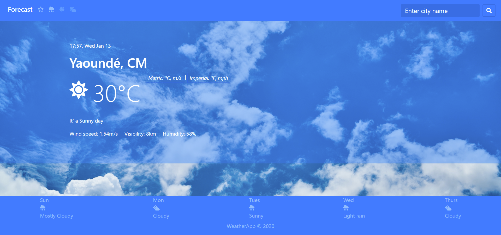

# My WeatherApp
In this project,a weather forecast site was created  using the weather API from [this open weather map site](https://openweathermap.org/). 
A user is able to search for a specific location's weather information and toggle displaying the data in Fahrenheit or Celsius.

## WeatherApp Screenshot


## Live Link
- [here]()

## Built With
- HTML
- JavaScript
- CSS
- Bootstrap

## Getting Started
To get a local copy of the repository please run the following commands on your terminal:
```
$ git clone https://github.com/Georjane/my_weather_app.git
$ cd my_weather_app
$ npm run watch
```

## Author

### 1. Witah Georjane
* Github: [@Georjane](https://github.com/Georjane)
* Twitter: [@WittyJany](https://twitter.com/WittyJany)
* LinkedIn: [Witah Georjane](https://www.linkedin.com/in/witah-georjane)

## Contributing
There are two ways of contributing to this project:

1. If you see something wrong or not working, please open the issue in issue section
2. If you see something to improve or to correct, and you have a solution to that, follow the below steps to contribute:
    1. Fork this repository
    2. Clone it on your local computer by running `git clone https://github.com/Georjane/my_weather_app.git` __Replace *your username* with the username you use on github__
    3. Open the cloned repository which appears as a folder on your local computer with your favorite code editor
    4. Create a separate branch off the *master branch*,
    5. Write your codes which fix the issue you found
    6. Commit and push the branch you created
    7. Open a pull request, comparing your new created branch with our original master branch [here](https://github.com/Georjane/my_weather_app/pulls)

## Show your support

Give a ⭐️ if you like this project!

## Acknowledgment
* [Microverse](https://www.microvese.org)
* [The Odin Project](https://www.theodinproject.com)